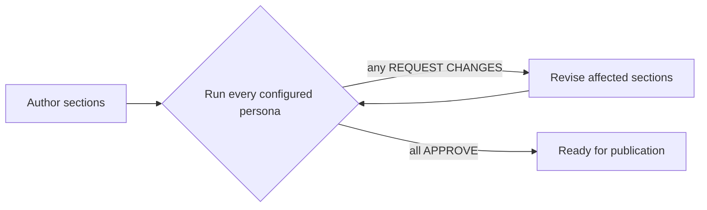

# doqmentary review board

Because doqmentary has **no compiler and no test suite**, the review board *is* the
quality gate and the definition of "done." A document is only ready for publication
when **every configured persona approves**.

## The board

The board is composed of the personas in the effective configuration's `personas` list.
The default board (from [`doqmentary.yaml`](../../doqmentary.yaml)):

| Persona | Lens |
|---|---|
| [Enterprise Architect](review-enterprise-architect.agent.md) | Principles & decisions alignment and selection quality |
| [Solution Architect](review-solution-architect.agent.md) | Technical soundness and pattern fitness |
| [Manager](review-manager-readability.agent.md) | Readability for a non-technical reader |

Each persona **reads the effective config** and reviews exactly the configured sections,
in order. Add or remove a persona in config and the board changes with no code change; a
persona removed from config is **not** reported as missing.

## The author → review → revise loop

1. **Author** — fill every configured section (see the
   [author skill](../skills/author-solution-outline/SKILL.md)).
2. **Review** — run **one pass per configured persona**. Each persona works its
   [checklist](review-enterprise-architect.agent.md) and returns **APPROVE** or
   **REQUEST CHANGES** with specific, section-scoped feedback.
3. **Revise** — apply feedback to the affected sections and **re-submit to the whole
   board**.
4. Repeat until **all personas approve**.

## The gate

- If **at least one** configured persona has not approved → the document is **NOT**
  ready for publication (do not `assemble` for release).
- When **every** configured persona approves → the document is ready; run
  `node cli/bin/doqmentary.mjs assemble <solution>` to build the wiki.

Completeness is part of every persona's checklist: a **missing or empty configured
section blocks approval**. The CLI `validate` command backs this with a deterministic
check (`node cli/bin/doqmentary.mjs validate <solution>`).
