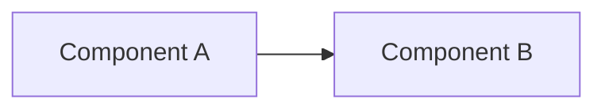

# Solution outline — default template

The default 9-section solution outline. Section ids and order mirror the global
[`doqmentary.yaml`](../../../../doqmentary.yaml). Page 1 (**Summary**) is *derived*:
it is synthesized from the body sections and authored last.

---

## Summary  *(derived — synthesized from the body, do not author directly)*

### Scope & background
_Summarizes **Project background**._

### Project architecture
_Summarizes **Target conceptual design**._

### Project principles
_Selected from the `principles` library, each with an application note._

### Dependencies
_Summarizes **Assumptions & dependencies**._

---

## Project background  *(situation — interview)*

Why this work exists; the current state and drivers.

## Detailed scope  *(situation — interview)*

What is explicitly in scope.

## Out of scope  *(situation — interview)*

What is explicitly excluded, to prevent ambiguity.

## Target conceptual design  *(situation — interview; render: mermaid)*

Prose description of the diagram.

## Key design decisions  *(enterprise — source: decisions)*

Relevant `ADR-*` entries and their impact on this solution.

## Assumptions & dependencies  *(situation — interview)*

Assumptions made and external dependencies relied upon.

## Risk & mitigations  *(situation — interview)*

Key risks, each with a concrete, proportionate mitigation.

## Next steps  *(situation — interview)*

Concrete next actions, each with a clear owner and outcome.
