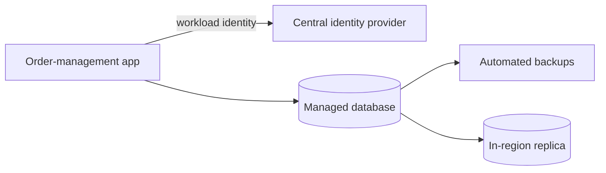

The order-management application authenticates through the central identity provider
using its workload identity and connects to a managed database instance. The managed
platform provides automated backups and an in-region replica for resilience.
